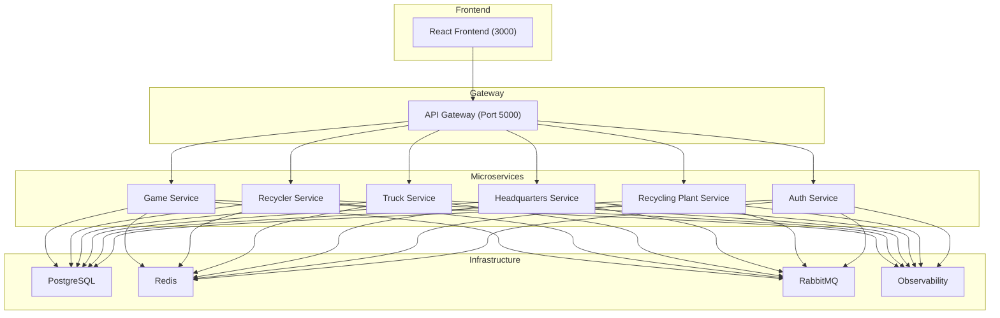

# Bottle Tycoon Microservice: Learn Microservices, Observability, and .NET 9

## 🎮 Project Overview

Bottle Tycoon is an **educational microservices project** designed to teach modern software architecture principles through a fun, interactive game. Manage a virtual bottle recycling network with multiple microservices, each handling different business domains, all monitored with OpenTelemetry for complete observability.

### 🎯 Learning Objectives
- Build scalable microservices using **ASP.NET Core 9**
- Implement event-driven architecture with **RabbitMQ/MassTransit**
- Complete observability with **OpenTelemetry, Jaeger, Prometheus, Loki, and Grafana**
- Container orchestration with **Docker and Docker Compose**
- Real-time frontend with **React and DaisyUI**
- Distributed tracing and correlation IDs
- Health checks and service communication patterns
- Database per service pattern

---

## 📊 Architecture Overview

### Service Architecture


### Services Breakdown

| Service | Purpose | Port | Container Count |
|---------|---------|------|-----------------|
| **Game Service** | Player state, credits, upgrades | 5001 | 1 |
| **Recycler Service** | Bottle collection, capacity tracking | 5002 | 3-5 (scalable) |
| **Truck Service** | Fleet management, deliveries | 5003 | 3-5 (scalable) |
| **Headquarters** | Dispatch coordination | 5004 | 1 |
| **Recycling Plant** | Credit calculation | 5005 | 1 |
| **API Gateway** | Request routing | 5000 | 1 |

---

## 🚀 Quick Start

### Prerequisites
- **Docker Desktop** (includes Docker & Docker Compose)
- **.NET 9 SDK** (for local development)
- **Node.js 18+** (for React frontend)
- **Git**

### Installation & Running

**Option 1: Docker Compose (Recommended - Everything in containers)**
```bash
# Clone the repository
git clone https://github.com/RangerChris/bottle-tycoon-microservice.git
cd bottle-tycoon-microservice

# Start all services
docker-compose up -d

# Wait 30 seconds for services to initialize
sleep 30

# Access the application
Frontend:        http://localhost:3000
API Gateway:     http://localhost:5000
Jaeger UI:       http://localhost:16686
Prometheus:      http://localhost:9090
Grafana:         http://localhost:3001 (admin/admin)
```

**Option 2: Local Development (Services running on host)**
```bash
# Terminal 1: PostgreSQL & Infrastructure
docker-compose up postgres redis rabbitmq jaeger prometheus loki grafana -d

# Terminal 2-7: Run each service
cd src/GameService && dotnet run
cd src/RecyclerService && dotnet run
# ... etc for other services

# Terminal 8: Frontend
cd src/Frontend && npm install && npm start
```

### Verify Services Are Running
```bash
# Check all containers
docker-compose ps

# Check API Gateway health
curl http://localhost:5000/health

# Check all services health
curl http://localhost:5000/health/ready
```

---


## 🧪 Testing

### Test Coverage Target: >80%

**Unit Tests**
- Business logic: Capacity calculations, credit math, upgrades
- Run: `dotnet test`

**Integration Tests**
- Database operations, event publishing
- Service-to-service communication
- Run: `dotnet test --filter Category=Integration`

**End-to-End Tests**
- Full game flows: Create player → deliver bottles → earn credits
- Run: `npm test` (from Frontend directory)

**Load Tests**
- Multiple players simultaneously
- Rapid delivery sequences
- Tools: k6, Apache JMeter

---

## 🐛 Troubleshooting

### Services won't start
```bash
# Check Docker is running
docker --version

# Check ports aren't in use
lsof -i :5000,5001,5002,5003,5004,5005

# View logs
docker-compose logs -f [service_name]
```

### Database connection errors
```bash
# Ensure PostgreSQL is running
docker-compose ps postgres

# Check connection string in appsettings.json
# Reset database: docker-compose down -v && docker-compose up
```

### RabbitMQ not accepting connections
```bash
# Check RabbitMQ is healthy
docker-compose logs rabbitmq

# Access RabbitMQ management: http://localhost:15672 (guest/guest)
```

### Frontend not loading
```bash
# Check Node.js version
node --version  # Should be 18+

# Rebuild dependencies
cd src/Frontend && npm ci

# Clear cache and restart
npm run build && npm start
```

---

## 📝 License

This project is licensed under the **MIT License** - see the [LICENSE](LICENSE) file for details.

---