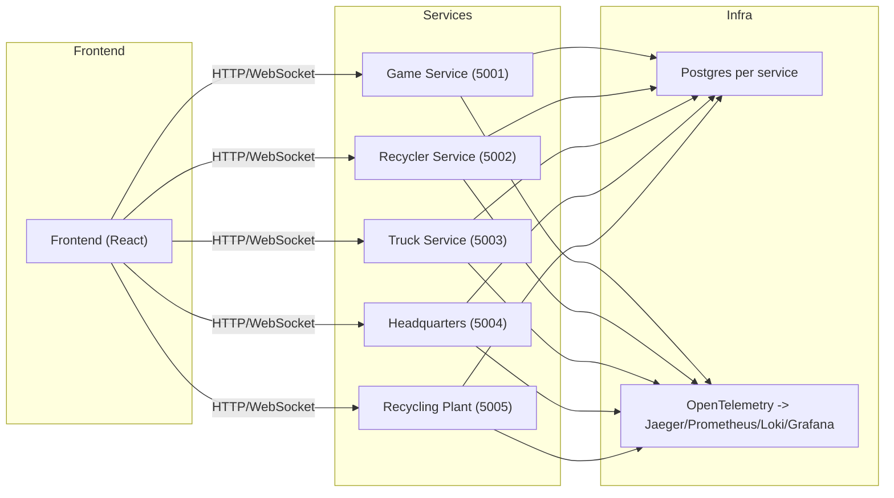

# Bottle Tycoon — Simplified Architecture

## Overview

This repository contains a simplified microservices demo for the Bottle Tycoon game. The architecture emphasizes small, independently deployable services that communicate directly over HTTP. The API Gateway, message broker (RabbitMQ), and Redis cache have been removed from the default development stack to make the system easier to run and reason about.

Goals:
- Keep services single-responsibility and independently deployable.
- Use direct HTTP APIs for inter-service communication (synchronous calls).
- Maintain full observability (OpenTelemetry → Jaeger, Prometheus, Loki, Grafana).
- Keep the development stack lightweight and easy to run with Docker Compose.

## High-level components

- Frontend (React) — user UI available on port 3000 when run locally.
- Game Service (5001) — player state, credits, purchase/upgrades, authoritative for player account balance.
- Recycler Service (5002) — models each recycler: capacity, visitor queue, bottle counts by type.
- Truck Service (5003) — fleet management and truck lifecycle (dispatch, travel, load, deliver).
- Headquarters Service (5004) — dispatch logic and scheduling across recyclers/trucks.
- Recycling Plant Service (5005) — final delivery processing and credit calculations.
- Shared Infrastructure — PostgreSQL (per-service DB), Observability stack (Jaeger, Prometheus, Loki, Grafana).

## Responsibilities & Data Ownership

- Game Service (owner of player state)
  - Stores player credits, purchase history, and upgrade levels.
  - Exposes transactional endpoints to debit/credit player balance.

- Recycler Service (owner of recycler state)
  - Maintains current bottle inventory per recycler.
  - Manages visitor arrival simulation and local queuing.

- Truck Service (owner of truck fleet state)
  - Manages truck status, current load, level and capacities.
  
- Headquarters Service
  - Orchestrates dispatch decisions by querying service APIs and calling endpoints directly.

- Recycling Plant Service (owner of delivery history and earnings calculations)
  - Processes truck deliveries via `POST /deliveries` endpoint.
  - Calculates gross and net earnings from bottle deliveries.
  - Stores delivery history and player earnings statistics.
  - Exposes Prometheus metrics for total deliveries processed (`deliveries_processed_total`).
  - Tracks bottles received by type and earnings distributed.

- Shared / Cross-cutting
  - Each service has its own Postgres schema/DB (database-per-service).
  - Redis has been removed from the default stack. If caching is required it should be an opt-in design inside a service (in-memory cache or a separately deployed cache).
  - Messaging via RabbitMQ has been removed. Event-driven flows should be migrated to direct HTTP endpoints or background workers where appropriate.

## Communication

Design principle: services expose clear RESTful HTTP endpoints and call each other directly for flows that were previously event-driven. Shared DTOs that represent API contracts should be kept in `src/Shared`.

Guidelines:
- Prefer synchronous HTTP calls for simple interactions and where immediate consistency is required.
- For longer-running or eventually-consistent workflows, use background workers or explicit polling endpoints within services.
- Keep API payloads small and document them via OpenAPI/Swagger.

## Example architecture diagram



## Key Flows (summary)

See project-description.md for detailed game mechanics.

### Truck Delivery Flow

1. **Frontend initiates delivery**: When a truck reaches the recycling plant, the frontend calls RecyclingPlantService
   ```
   POST /deliveries
   Body: { truckId, playerId, loadByType: { glass, metal, plastic }, operatingCost }
   ```

2. **RecyclingPlantService processes delivery**:
   - Validates truck ID, player ID, and load contents
   - Calculates earnings: glass (4 credits), metal (2.5 credits), plastic (1.75 credits)
   - Computes net earnings (gross - operating cost)
   - Stores delivery record in database with timestamp
   - Updates player earnings statistics (total, average, count)
   - **Increments metrics**: `deliveries_processed_total`, `bottles_received_total` (by type)
   - Returns: `{ success, deliveryId, grossEarnings, netEarnings }`

3. **Frontend credits player**: Calls GameService `POST /player/{id}/deposit` with net earnings

4. **Metrics exported**: Prometheus scrapes `/metrics` endpoint, Grafana displays in dashboards

This flow ensures RecyclingPlantService is the authoritative source for delivery processing and tracking.

## Deployment

Primary approach: Docker Compose to run the full stack locally and for integration tests. The compose stack no longer includes RabbitMQ or Redis by default. Production should use container orchestrators (Kubernetes) and secrets managers.

Suggested service ports (local / compose):
- Frontend: 3000
- Game Service: 5001
- Recycler Service: 5002
- Truck Service: 5003
- Headquarters: 5004
- Recycling Plant: 5005
- Postgres: 5432 (per container)
- Jaeger: 16686
- Prometheus: 9090
- Grafana: 3001
- Loki: 3100

Docker Compose notes:
- Use one Postgres instance per service or schema-per-service depending on desired isolation.
- Keep named volumes to persist DB data in development when useful for debugging.

## Observability

Tracing:
- Instrument inbound HTTP requests and outbound HTTP calls with OpenTelemetry.
- Jaeger UI (16686) for trace visualization.

Metrics:
- Expose Prometheus metrics at `/metrics` for each service.
- Track request rates, latencies, error rates, and business metrics (credits earned, bottles processed).

Logging:
- Use structured JSON logs (Serilog recommended for .NET) and forward to Loki.
- Include correlation IDs, service, environment, and log level.

## Health checks

- Readiness: `/health` — service check for itself and all required resources/databases.
- Liveness: `/health/live` — service process is running.

## Testing strategy

Unit tests
- Use xUnit v3, Moq, and Shouldly for business logic tests.

Integration tests
- Use Docker Compose to run Postgres and the services required for a scenario. Remove RabbitMQ/Redis test containers from standard integration setups.

End-to-end
- Run the full stack in Docker Compose and exercise user flows via API-driven tests or frontend e2e tests.

## Next steps & migration notes

- Migrate any event-driven flows previously implemented with RabbitMQ to direct HTTP endpoints or background workers. Ensure side-effecting consumer logic is preserved by converting consumers into service endpoints or hosted background services.
- Add example OpenAPI specs for each service and publish them alongside each project.
- Update CI workflows and docker-compose files to reflect the simplified stack.

---

Appendix: Quick reference ports and endpoints

- Jaeger: http://localhost:16686
- Grafana: http://localhost:3001 (admin/admin)
- Prometheus: http://localhost:9090