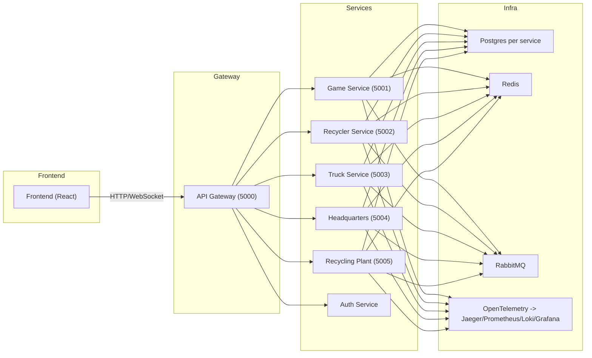
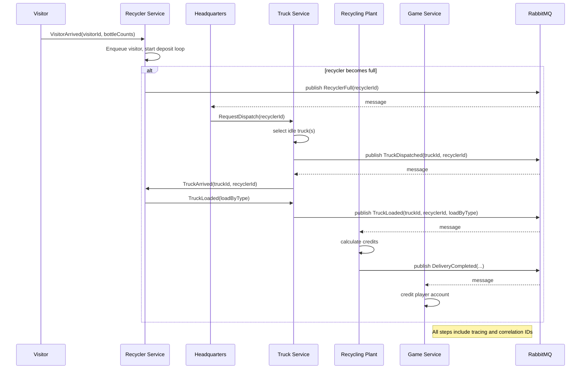

# Bottle Tycoon Microservice — Architecture

## Overview

Bottle Tycoon is an educational microservices system that models a bottle recycling game. The architecture favors small, independently deployable services, event-driven communication, and full observability for learning and demonstration purposes.

Goals:
- Keep services single-responsibility and independently deployable.
- Use events (RabbitMQ/MassTransit) for decoupled background workflows.
- Provide end-to-end observability (OpenTelemetry → Jaeger, Prometheus, Loki, Grafana).
- Demonstrate resiliency patterns (retries, circuit breakers, idempotency) and infrastructure-as-code via Docker Compose.

## High-level components

- API Gateway (ports: 5000) — routes HTTP/WebSocket requests from frontend to services, central OpenAPI surface.
- Frontend (React) — user UI available on port 3000 when run locally.
- Game Service (5001) — player state, credits, purchase/upgrades, authoritative for player account balance.
- Recycler Service (5002) — models each recycler: capacity, visitor queue, bottle counts by type.
- Truck Service (5003) — fleet management and truck lifecycle (dispatch, travel, load, deliver).
- Headquarters Service (5004) — dispatch logic and smart scheduling across recyclers/trucks.
- Recycling Plant Service (5005) — final delivery processing and credit calculations.
- Shared Infrastructure — PostgreSQL (per-service DB), Redis (caching), RabbitMQ (events), Observability stack (Jaeger, Prometheus, Loki, Grafana).

## Responsibilities & Data Ownership

- Game Service (owner of player state)
  - Stores player credits, purchase history, and upgrade levels.
  - Exposes transactional endpoints to debit/credit player balance.

- Recycler Service (owner of recycler state)
  - Maintains current bottle inventory per recycler.
  - Manages visitor arrival simulation and local queuing.

- Truck Service (owner of truck fleet state)
  - Manages truck status, current load, level and capacities.

- Headquarters Service
  - Orchestrates dispatch decisions using events and by querying services.

- Recycling Plant Service
  - Calculates credits from delivered bottles and emits events when deliveries complete.

- Shared / Cross-cutting
  - Each service has its own Postgres schema/DB (database-per-service).
  - Redis used for ephemeral coordination/cache (e.g., leader election, rate limits, aggregation).
  - RabbitMQ used for asynchronous events and commands via MassTransit.

## Messaging and Eventing

Design principle: publish domain events to express facts. Services subscribe to events they care about.

Common topics/events (MassTransit exchanges/queues):
- VisitorArrived { recyclerId, visitorId, bottleCounts }
- RecyclerFull { recyclerId, timestamp }
- TruckDispatched { truckId, recyclerId, expectedCapacity }
- TruckArrived { truckId, recyclerId }
- TruckLoaded { truckId, recyclerId, loadByType }
- DeliveryCompleted { truckId, plantId, loadByType, creditsEarned }
- CreditsCredited { playerId, amount, reason }

Example event payload (DeliveryCompleted):

```json
{
  "truckId": "truck-12",
  "plantId": "plant-1",
  "timestamp": "2025-11-15T12:34:56Z",
  "loadByType": { "glass": 30, "metal": 10, "plastic": 7 },
  "creditsEarned": 250.75
}
```

Guidelines:
- Events are append-only facts. Consumers should be idempotent.
- Use correlation IDs (W3C Trace Context) so traces span message producers and consumers.
- Keep event payloads small and version them (v1, v2) when evolving.

## Key Flows (Mermaid diagrams)

### Architecture diagram



### Visitor → Recycler → Truck → Plant sequence



Note: the sequence diagram simplifies parallelism (multiple visitors, multiple trucks). The real system supports concurrent flows.

## Deployment

Primary approach: Docker Compose to run the full stack locally and for integration tests. Production should use container orchestrators (Kubernetes) and secrets managers.

Suggested service ports (local / compose):
- Frontend: 3000
- API Gateway: 5000
- Game Service: 5001
- Recycler Service: 5002
- Truck Service: 5003
- Headquarters: 5004
- Recycling Plant: 5005
- Postgres: 5432 (per container)
- Redis: 6379
- RabbitMQ: 5672 (AMQP) / 15672 (Management)
- Jaeger: 16686
- Prometheus: 9090
- Grafana: 3001
- Loki: 3100

Docker Compose notes:
- Use one Postgres instance per service or schema-per-service depending on desired isolation.
- Use named volumes to persist DB data in development when useful for debugging.
- Compose profiles: support a `--profile test` for integration test environment (use ephemeral DBs and test containers).

## Observability

Tracing:
- Instrument inbound HTTP requests, outbound HTTP calls, and message producers/consumers with OpenTelemetry.
- Ensure trace context flows with messages via W3C Trace Context headers in message metadata.
- Jaeger UI (16686) for trace visualization.

Metrics:
- Expose Prometheus metrics at `/metrics` for each service.
- Track request rates, latencies, error rates, queue lengths, and business metrics (credits earned, bottles processed).

Logging:
- Use structured JSON logs (Serilog recommended for .NET) and forward to Loki.
- Include correlation IDs, service, environment, and log level.

Dashboards:
- Grafana dashboards for system health, per-service latency/error trends, business KPIs, and infrastructure metrics.

## Health checks

- Liveness: `/health/live` — service process is running.
- Readiness: `/health/ready` — service ready to serve traffic (DB/Rabbit/Redis connections healthy).

Health checks should be lightweight and safe to call frequently.

## Scaling & Resilience

Scaling:
- Scale stateless services (API Gateway, Headquarters) horizontally behind a load balancer.
- Scale Recycler and Truck services based on CPU and queue metrics. Horizontal scaling requires careful coordination for shared resources — prefer partitioning by recyclerId or using Redis for lightweight coordination.

Resilience patterns:
- Retry with exponential backoff on transient failures (database, network).
- Circuit breakers for external dependencies.
- Idempotency keys for critical operations (crediting accounts, delivery processing).
- Poison message handling and dead-letter queues for RabbitMQ.

## Security

- Authentication & Authorization
  - Central Auth Service issues tokens; API Gateway validates JWTs and forwards principal info to services.
  - Enforce role-based access for management endpoints.

- Transport & Secrets
  - TLS in transit for production (between services and external endpoints).
  - Don’t store secrets in source. Use environment secrets (Docker secrets, Kubernetes Secrets, Vault).

- Network segmentation
  - Limit direct access to databases; only allow service network access.

- Input validation
  - Validate all incoming requests and message payloads at the boundary.

## Configuration & Environment variables

Keep runtime configuration in environment variables. Example per-service vars:

- SERVICE_NAME
- DOTNET_ENVIRONMENT
- CONNECTION_STRING (Postgres)
- REDIS_URL
- RABBITMQ__HOST, RABBITMQ__USER, RABBITMQ__PASSWORD
- OTEL_EXPORTER_JAEGER_ENDPOINT
- PROMETHEUS_SCRAPE_ENABLED
- HEALTH__PATHS

Store per-service configuration in appsettings.{Environment}.json for .NET and override with environment variables in containers.

## Testing strategy

Unit tests
- Use xUnit v3, Moq, and Shouldly for business logic tests.
- Keep tests small and fast.

Integration tests
- Use testcontainers or Docker Compose to run Postgres/RabbitMQ/Redis and test service interactions.
- Tag integration tests and run them in CI only when the environment is available.

End-to-end
- Run the full stack in Docker Compose and exercise user flows via the frontend e2e tests (or API-driven tests).

CI
- Run unit tests on every PR. Run integration and e2e tests on merge to main or nightly.

## Operational concerns

- Backups: schedule Postgres backups for persisted game state.
- Migrations: keep EF Core migrations per-service in source control; run migrations as part of deployment.
- Alerting: set alerts for high error rates, queue growth, and low available credits thresholds (business alert).

## Next steps & evolution

- Add example OpenAPI specs for each service and publish via the API Gateway.
- Add a messaging contract repository (shared DTOs with versioning guidelines).
- Add example Kubernetes manifests and Helm charts for production deployment.
- Expand tests: add fuzz tests for message consumers, and performance/load tests (k6).

---

Appendix: Quick reference ports and endpoints

- API Gateway health: http://localhost:5000/health
- Jaeger: http://localhost:16686
- Grafana: http://localhost:3001 (admin/admin)
- Prometheus: http://localhost:9090
- RabbitMQ management: http://localhost:15672 (guest/guest)